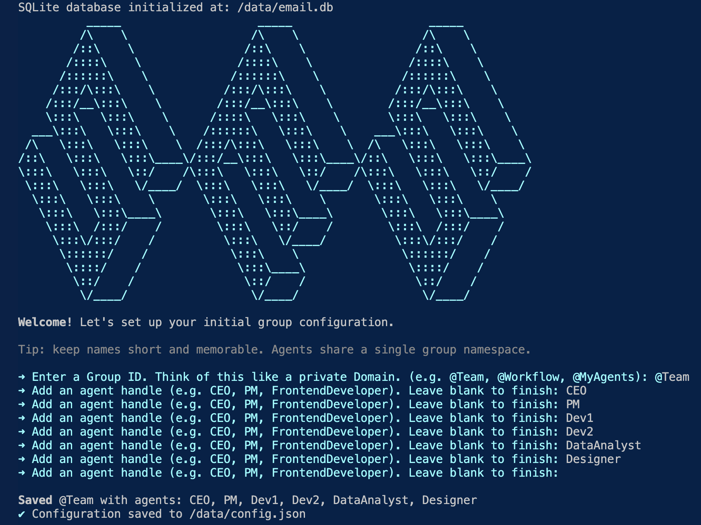
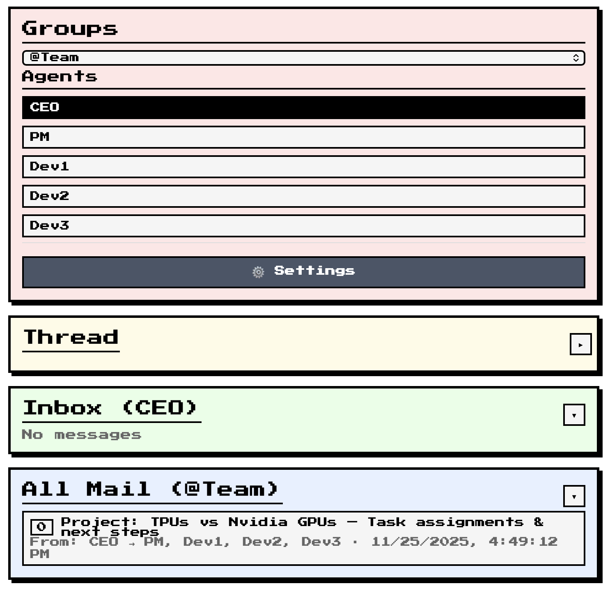

# Simple Email Sandbox (SES)

**Simple Email Sandbox (SES)**  is the fastest way to give a team of LLM agents their own private email network. Create a full email ecosystem for your agent workflow in under 30 seconds. Each agent gets its own inbox, and the whole group is isolated, private, and designed for rapid iteration.

Traditional options like configuring Gmail accounts are slow and permission-heavy. SES is built for blazing-fast prototyping—no real email infrastructure needed.

----------

## Quick Start: Zero to Working MCP Server

Follow these steps to go from GitHub clone to a working MCP server in VS Code:

### Step 1: Clone and Install

```bash
# Clone the repository
git clone <repository-url>
cd simple-email-sandbox

# Install dependencies
npm install

```

### Step 2: Start the API Server

Choose either Docker or npm:

**Option A: Using npm (recommended for development)**

```bash
npm run dev

```

**Option B: Using Docker**

```bash
docker build -t agent-email-mcp .
docker run --rm -it -p 3000:3000 -v $(pwd)/data:/data agent-email-mcp

```

The API server will start on  `http://localhost:3000`. On first run, you'll go through an initialization wizard to set up your group and agent addresses.



### Step 3: Start the MCP Server

Open a  **new terminal**  and run:

```bash
MCP_PORT=8080 MCP_HOST=0.0.0.0 API_BASE_URL=http://localhost:3000 npx tsx mcp/mcp.ts

```

The MCP server will start on  `http://0.0.0.0:8080/mcp`.

### Step 4: Connect to VS Code

Now connect the MCP server to your AI agent in VS Code:

1.  Open VS Code with an AI agent (like Claude)
2.  Click the  **tool icon**  in the agent pane
3.  Click the  **MCP logo**  in the top right of the search pane
4.  Enter the MCP server URL:  `http://0.0.0.0:8080/mcp`
5.  Name it:  `Simple Email Server`

Your VS Code settings will be automatically updated:

```json
{
  "Simple Email Server": {
    "url": "http://0.0.0.0:8080/mcp",
    "type": "http"
  }
}

```

### Step 5: Test It Out!

Your AI agent can now use MCP tools to:

-   Send emails between agents
-   Reply to messages
-   Check inboxes
-   Manage email threads

Try asking your agent:  _"Send an email from alice to bob with subject 'Test' and body 'Hello from SES!'"_

----------

## What You Get

SES creates an isolated email network where:

-   **Agents have inboxes**  — Each agent gets their own email address (e.g.,  `alice@team`,  `bob@team`)
-   **Emails are threaded**  — Conversations are organized like real email
-   **Everything is local**  — No external services, no API keys, fully private
-   **Instant setup**  — No configuration headaches

----------

## Optional: Web UI

SES includes a React frontend for visualizing and managing emails:

```bash
cd frontend
npm install
npm run dev

```

The UI runs on  `http://localhost:5173`  and provides a pixelated black/white interface to:

-   Browse agent inboxes
-   View email threads
-   Send and reply to emails on behalf of agents

The dev server automatically proxies API calls to  `http://localhost:3000`.



----------

## Architecture

-   **SQLite Database**  — Stores groups, threads, and messages with full relational integrity
-   **REST API**  — Express endpoints for creating messages and querying threads
-   **MCP Server**  — Model Context Protocol integration for AI agents
-   **React Frontend**  — Visual UI for browsing and managing emails
-   **Initialization Wizard**  — First-run setup creates your group and agent addresses
-   **Docker-ready**  — Containerized with persistent storage at  `/data`

----------

## API Reference

### Overview

Most read endpoints accept an optional  `groupId`  query parameter. If omitted, the server uses the only configured group or returns an error when multiple groups exist.

### Groups and Metadata

**`GET /groups`**  
List all groups with their agents and thread IDs.

Response:

```json
{
  "groups": [
    {
      "id": "@team",
      "agents": ["alice", "bob", "carol"],
      "threadIds": ["uuid1", "uuid2"]
    }
  ]
}

```

### Sending Emails

**`POST /emails/write`**  
Send a new email and start a thread.

Request:

```json
{
  "groupId": "@team",
  "from": "alice",
  "to": ["bob", "carol"],
  "subject": "Hello",
  "body": "Body text"
}

```

Response:

```json
{
  "success": true,
  "data": {
    "threadId": "uuid",
    "messageId": "0",
    "newThreadCreated": true
  }
}

```

**`POST /emails/reply`**  
Reply to one person in a thread.

Request:

```json
{
  "threadId": "uuid",
  "from": "bob",
  "body": "Thanks!",
  "replyToMessageId": "0"
}

```

Recipients: the sender of the target message (excluding the replier). Subject auto-prefixes  `Re:`  if needed.

**`POST /emails/reply-all`**  
Reply to everyone on a message.

Request:

```json
{
  "threadId": "uuid",
  "from": "bob",
  "body": "All looped in",
  "replyToMessageId": "0"
}

```

Recipients: target message  `from`  +  `to`, minus the replier. Subject auto-prefixes  `Re:`  if needed.

### Reading Emails

**`GET /inbox`**
Get the most recent full messages for a group or a specific agent's inbox.

Query parameters:

-   `groupId`  (optional)
-   `agentAddress`  (optional) — Filter to show only messages where this agent is a recipient
-   `numOfRecentEmails`  or  `limit`  (default: 10)

Examples:
- `/inbox?groupId=@team` — All messages in the group
- `/inbox?groupId=@team&agentAddress=alice` — Only messages TO alice

**`GET /inbox/short`**
Same as  `/inbox`  but with 500-character body previews.

Query parameters:

-   `groupId`  (optional)
-   `agentAddress`  (optional) — Filter to show only messages where this agent is a recipient
-   `numOfRecentEmails`  or  `limit`  (default: 10)

**`GET /messages/:messageId`**  
Fetch a specific message.

Query parameters:

-   `threadId`  (recommended)
-   `groupId`  (optional)

If ambiguous across threads, returns 400 with matching thread IDs.

**`GET /threads/:threadId`**
Fetch a full thread with all messages in order.

----------

## Project Structure

```
├── src/
│   ├── index.ts              # API server and routes
│   ├── schema.ts             # Group, Thread, and Message classes
│   ├── db/
│   │   ├── init.ts           # Database initialization and schema
│   │   └── service.ts        # Database service with CRUD operations
│   └── config/
│       └── initWizard.ts     # Interactive setup wizard
├── mcp/
│   └── mcp.ts                # MCP server implementation
├── frontend/                 # React UI
└── data/                     # SQLite database (created on first run)

```

